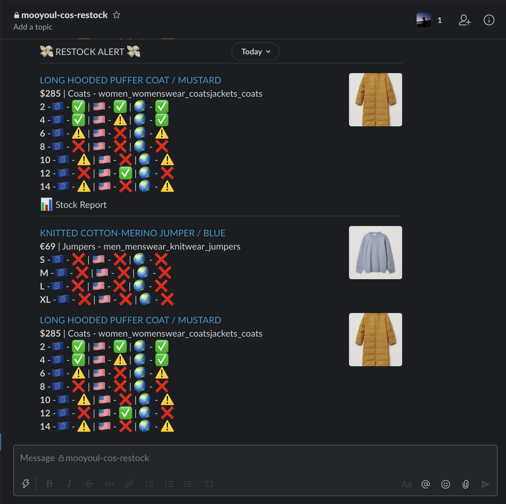

# cos-restocked

> Personal In-Stock Tracker for [COS Online Store](https://www.cosstores.com/)

# 🧥 Contents

<table>
<thead>
<tr>
  <th>Image</th>
  <th>Name</th>
</tr>
</thead>
<tbody>
<tr>
<td colspan="2" align="center">(empty)</td>
</tr>
</tbody>
</table>

**[⬆ Back to Index](#-contents)**

## Slack Support

## Configuration / Deployment

See [workflow.yml](/.github/workflows/main.yml)

## License

[MIT](LICENSE)

See full license on [mooyoul.mit-license.org](http://mooyoul.mit-license.org/)